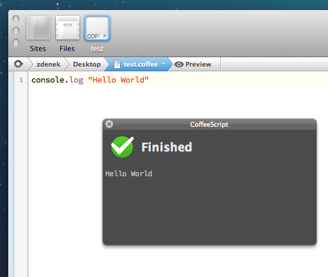
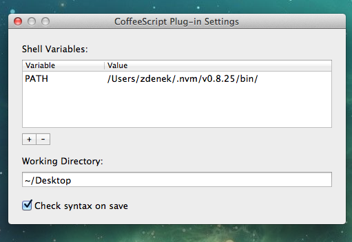

# CoffeeScript Plug-in for Coda

## Overview
CoffeeScript Plug-in for Coda offers a convenient way to build and run CoffeeScript directly from within Coda 2. 

It offers `Compile to Javascript` (`⇧⌘M`) and `Run` (`⇧⌘U`) commands as well as automatic on-save syntax check.

## Screenshots



## Requirements
* Coda 2
* CoffeeScript
* Tested on OS X Mavericks

## Instalation

### From a Release
Download the latest release, unpack and copy the plug-in to Coda 2 Plug-ins directory – `${USER_LIBRARY_DIR}/Application Support/Coda 2/Plug-ins/`.

### Using Xcode
Open the project using Xcode. Set target to release and build. Run script build phase should copy the plug-in into appropriate directory.

### Setup CoffeeScript
In order for the plug-in to work properly you need to set the path to your `coffee` executable. 

First **make sure Node.js and CoffeeScript** is installed on your system. Then in Terminal run the following command:

```sh
$ which coffee
/Users/zdenek/.nvm/v0.8.25/bin/coffee
```

Open plug-in settings `Plug-ins > CoffeeScript > Settings` and copy the path from terminal to the *PATH Value* shell variable in the Settings dialog. Close the dialog & enojoy the CoffeeScript Plug-in for Coda!

## License
Copyright ©2014, Zdenek Nemec (http://zdne.org)

Licensed under the Apache License, Version 2.0 (the "License");
you may not use this file except in compliance with the License.
You may obtain a copy of the License at

   http://www.apache.org/licenses/LICENSE-2.0

Unless required by applicable law or agreed to in writing, software
distributed under the License is distributed on an "AS IS" BASIS,
WITHOUT WARRANTIES OR CONDITIONS OF ANY KIND, either express or implied.
See the License for the specific language governing permissions and
limitations under the License.

## Acknowledgements
This work uses parts of the Kelan Champagne's YRKSpinningProgressIndicator (https://github.com/kelan/yrk-spinning-progress-indicator).
